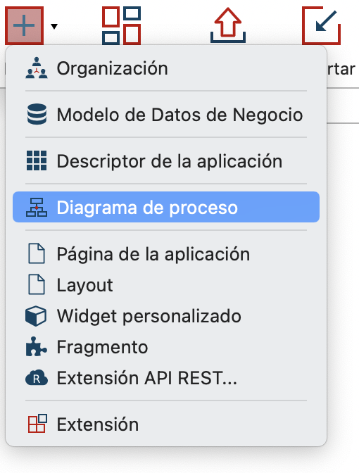
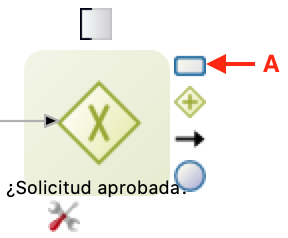
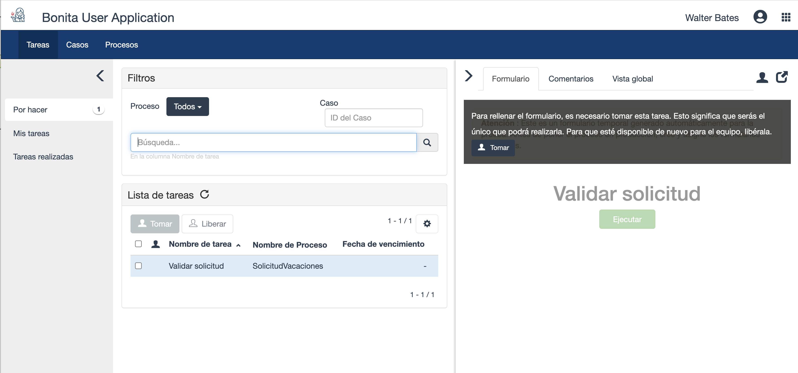

---
Ejercicio 1 - Modelado de procesos BPMN
---

## Objetivo

El objetivo de este ejercicio es crear una primera versión "básica" del diagrama del proceso de solicitud de vacaciones.

En esta etapa, el proceso es ejecutable pero aún no presenta interés funcional porque no tiene formularios ni datos.
Lo completaremos en los siguientes ejercicios.

Nota: la validación de los diagramas en Bonita Studio debe activarse manualmente. Si corrigas un error o un mensaje de advertencia, debes ir a la pestaña **Estado de validación** y hacer clic en el botón **Refrescar** o ir al menú **Archivo** y hacer clic en el botón **Validar**.

## Resumen de las instrucciones

Para hacer el ejercicio, crea un diagrama *DiagramaSolicitudVacaciones* que contenga un proceso *SolicitudVacaciones* en la versión *1.0.0*.

El grupo de procesos debe incluir los siguientes elementos BPMN:
* Un evento de inicio *Ingresar solicitud*
* Una tarea humana *Validar solicitud*
* Una puerta exclusiva *¿Solicitud aprobada?*
* Una tarea automática *Notificar aprobación*
* Una condición siempre verdadera (`true`) en la transición que conecta la puerta exclusiva a la tarea de notificación de aprobación
* Una tarea automática *Notificar rechazo*
* Una transición predeterminada que conecta la puerta exclusiva a la tarea de notificación de rechazo
* Un evento final *Fin - Solicitud aceptada*
* Un evento final *Fin - Solicitud rechazada*

## Instrucciones paso a paso

1. Inicia Bonita Studio
1. En la página de inicio de Studio, haz clic en **Nuevo proyecto** en el menú Diseño.
1. Ingrese el nombre del proyecto _"SolicitudVacaciones"_.
1. Crea un nuevo diagrama de procesos.

    

1. Especifica el nombre del diagrama y el del proceso:
    - Haz clic en el menú **Archivo / Renombrar Diagrama...** en la parte superior del Studio o haz click derecho sobre el diagrama y pulsa en **Renombrar**
    - Ingresa *DiagramaSolicitudVacaciones* para el nombre del diagrama y *SolicitudVacaciones* para el del pool y *1.0.0* para la versión del diagrama y del pool
   
   
   
1. Cambia el nombre del evento de inicio a *Ingresar solicitud*:
    - Selecciona el evento de inicio presente en el diagrama
    - Navega a la pestaña **General / General** y luego ingrese el nuevo nombre
1. Cambia el nombre de la tarea humana a *Validar solicitud*
1. Agrega una puerta exclusiva *¿Solicitud aprobada?* Después de la tarea *Validar solicitud*:
    - Selecciona la tarea *Validar solicitud*, arrastra y suelta desde el icono contextual de la puerta lógica
    - Una vez que se ha creado la puerta, usa el ícono contextual **caja de herramientas** (1) para cambiar su tipo a **Exclusivo** (2)
   
   
   
   - Cambia el nombre de la puerta a *¿Solicitud aprobada?*
1. Crea una tarea automática *Notificar aprobación* desde la puerta lógica:
    - Selecciona la puerta lógica, arrastra y suelta desde el icono de tarea contextual (A)
   
      
      
   
    - Una vez que se ha creado la tarea automática, cambiala el nombre
1. Crea una tarea automática *Notificar rechazo* desde la puerta lógica
1. Agrega un evento de terminación *Fin - Solicitud aprobada* después de la tarea automática *Notificar aprobación*:
    - Selecciona la tarea automática *Notificar aprobación*
    - Arrastra y suelta desde el ícono de evento contextual (A) y selecciona el evento final (B)
   
   
  
    - Una vez que se ha creado el evento, cámbiale el nombre
1. Agrega un evento de finalización *Fin - Solicitud rechazada* después de la tarea automática *Notificar rechazo*
1. Nombra las 2 transiciones entre la puerta lógica y los pasos automáticos:
    - Selecciona la transición
    - Navega a la pestaña **General / General** luego ingresa el nombre
    - La transición que conduce al paso *Notificar aprobación* se llamará *Sí* y la otra *No*
1. Configura la condición en la transición *Sí* para que el flujo siga esta rama:
    - Selecciona la transición
    - Ingresa el valor `true` en el campo **Condición** (pestaña **General / General**). Si no ves el campo **Condición**, probablemente sea porque agregaste una puerta lógica paralela en lugar de una exclusiva.
   
   
   
1. Configura la transición *No* como el flujo por defecto:
    - Selecciona la transición *No*
    - Marca la casilla **Flujo por defecto**
1. Actualiza la validación del diagrama:
    - Navega en la pestaña **Estado de validación**
    - Haz clic en el botón **Actualizar**
    - Ignora las 3 advertencias sobre los formularios
1. Verifica que el diagrama se vea así:
   
   
   
1. Guarda el proceso:
    - Haz clic en el botón **Guardar** en la barra de menú superior de Bonita Studio
1. Ejecuta el proceso para probarlo:
    - Selecciona el pool de procesos (la forma rectangular que contiene las tareas y eventos)
    - Haz clic en el botón  en la barra de menú superior del Studio (si el botón está desactivado, asegúrate de que el grupo esté seleccionado)
    - Tu navegador debe abrir y presentar un formulario de creación de instancias generado automáticamente
    - Envía el formulario
    - Deberías ser redirigido a la bandeja de entrada de tareas del Portal Bonita
    - Selecciona la tarea *Validar solicitud*
    - Haz clic en **Tomar** en la parte superior derecha de la pantalla 
    - Envía el formulario para el paso *Validar solicitud* haciendo clic en el botón **Ejecutar** para completar el caso

[Ejercicio siguiente: creación de datos y definición de contratos](02-Agregar-datos-y-especificar-contratos.md)
